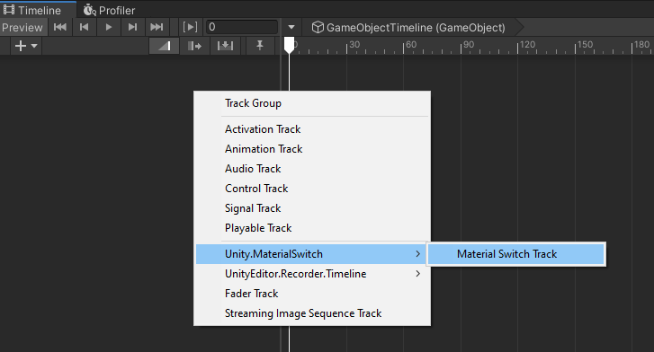
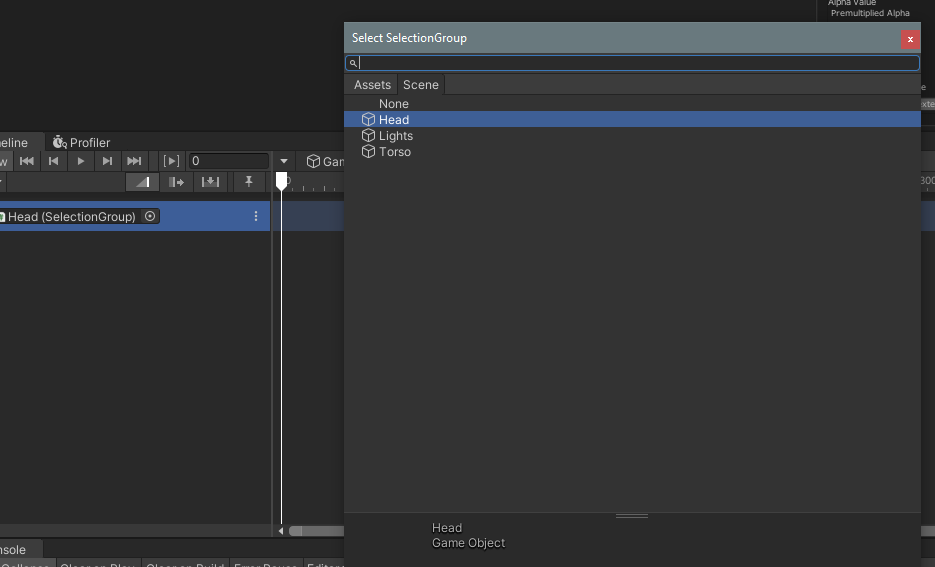
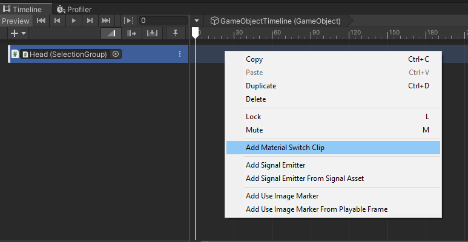
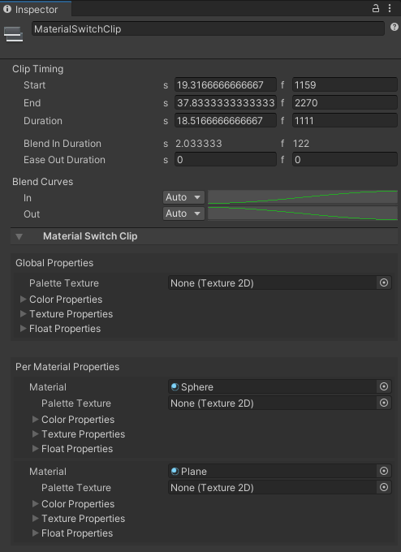
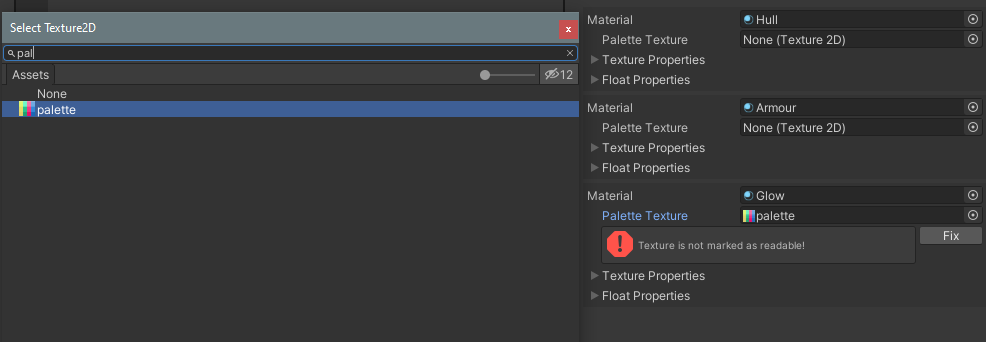
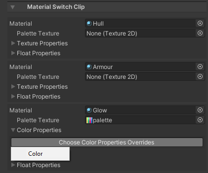
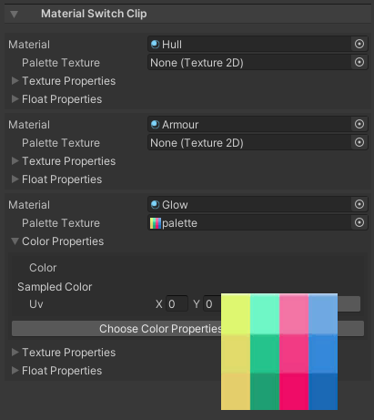

Material Switch User Documentation
==================================

# Overview
Material Switch allows you to change and blend between material parameters using Timeline.

# Requirements
Material Switch uses the [Selection Groups](https://docs.unity3d.com/Packages/com.unity.selection-groups@latest) package. 
You use a selection group to specify the set of renderers that have material parameters you want to use in Timeline with a Material Switch clip. 
The Selection Group option "enable runtime groups" must be enabled in the Selection Group settings.

# Getting Started
1. In the timleline window, add a new Material Switch Track.   
2. The new track has an object field which you must change to the Selection Group you want to modify. All renderers and materials in this selection group can be used in the clips you will add to this track. You will manually choose which properties to use per clip in a later step.   
3. Add a new material switch clip to the track.   
4. The inspector window will show a number of options for modifying the clip. You can add values to override texture, color and float properties. In the next step, we will override a colour property.   
5. To enable colour properties on the clip, we must assign a palette texture in the inspector. If the texture is not readable, a warning box will appear giving you the option to fix the texture settings with a single click.   
6. The Colour Properties foldout is now enabled. Click the "Choose Color Properties Overrides" button, and a dropdown will appear with the available colour properties you can override. Choose a colour property.   
7. A new row appears in the foldout, with a "Pick Color" button. If you click this button, the palette image will appear, allowing you to choose a new colour for the property.   
8. You can now play the clip, and see your colour changes take effect.

